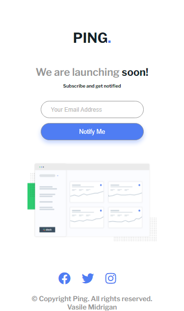
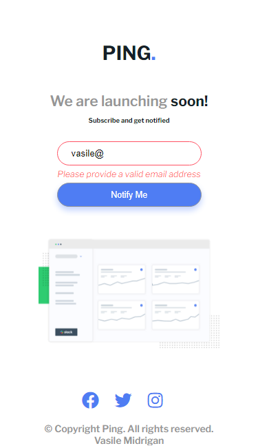
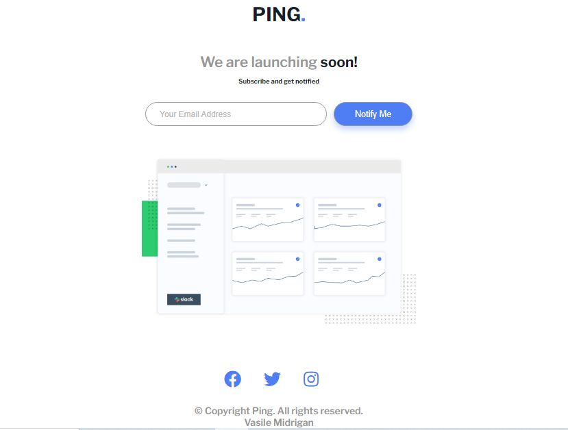
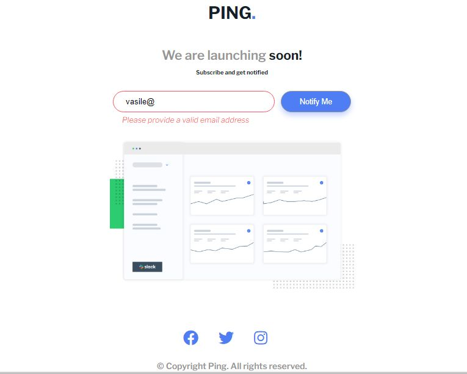
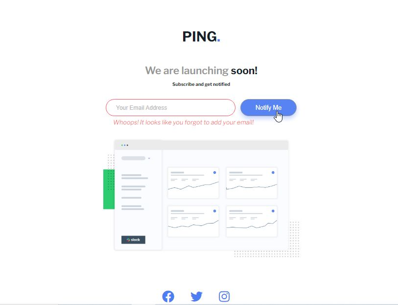

# Frontend Mentor - Ping coming soon page solution

This is a solution to the [Ping coming soon page challenge on Frontend Mentor](https://www.frontendmentor.io/challenges/ping-single-column-coming-soon-page-5cadd051fec04111f7b848da). Frontend Mentor challenges help you improve your coding skills by building realistic projects.

## Table of contents

- [Overview](#overview)
  - [The challenge](#the-challenge)
  - [Screenshot](#screenshot)
  - [Links](#links)
- [My process](#my-process)
  - [Built with](#built-with)
- [Author](#author)

## Overview

### The challenge

Users should be able to:

- View the optimal layout for the site depending on their device's screen size
- See hover states for all interactive elements on the page
- Submit their email address using an `input` field
- Receive an error message when the `form` is submitted if:
  - The `input` field is empty. The message for this error should say _"Whoops! It looks like you forgot to add your email"_
  - The email address is not formatted correctly (i.e. a correct email address should have this structure: `name@host.tld`). The message for this error should say _"Please provide a valid email address"_

### Screenshots:

Mobile version

Mobile version - error state

Desktop Version

Desktop version - Invalid email format error state

Desktop version - Empty input field error state

### Links

- Solution URL: [github repo](https://github.com/vasilemidrigan/subscribe-page-layout)
- Live Site URL: [click here](https://vasilemidrigan.github.io/subscribe-page-layout/)

## My process

### Built with

- Mobile-first workflow
- JavaScript
- SASS(SCSS)
- Semantic HTML5 markup

## Author

- Website - [vasilemidrigan.github.io](https://vasilemidrigan.github.io/)
- Github - [vasilemidrigan](https://github.com/vasilemidrigan)
- LinkedIn - [Vasile Midrigan](https://www.linkedin.com/in/vasile-midrigan/)
- Frontend Mentor - [@vasilemidrigan](https://www.frontendmentor.io/profile/vasilemidrigan)
